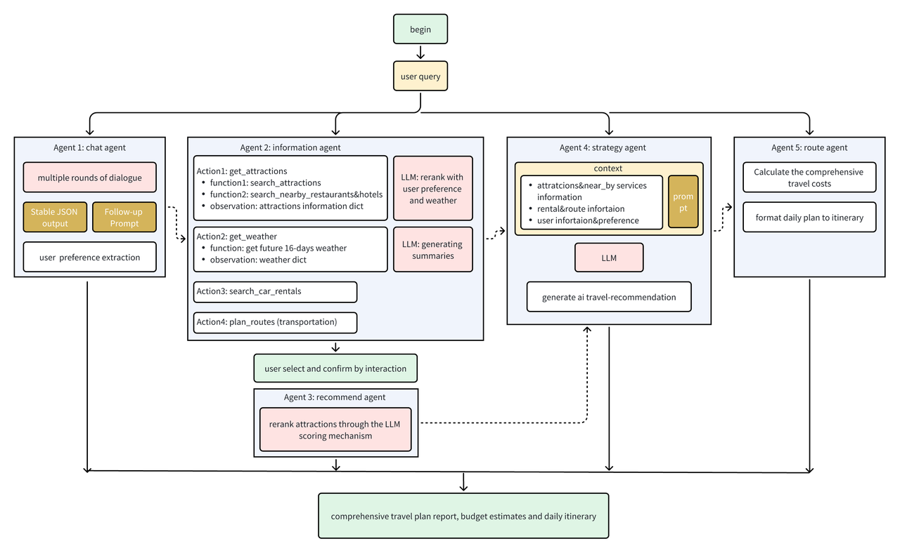

# Introuction
This project focuses on building an Al travel planning assistant, aiming to leverage the core strengths of LLM-powered Agents to provide users with a more personalized, fluid and intelligent LUI planning service.
# Main process
- Application: conversation by natural language; view attractions or other places details; view travel plan, suggestions and itinerary
- Agent layer: chat agent-->information agent-->(recommend agent)-->strategy agent-->route agent
- API Service layer: RapidAPI, Google Maps, Open-Meteo
- LLM model choice：DeepSeek-chat

A complete project overview is available in the Feishu document➡️https://qcnu7ux7jc90.feishu.cn/wiki/JS3kwRxhEiOLPYkXCUjc1ZMpngb?from=from_copylink
