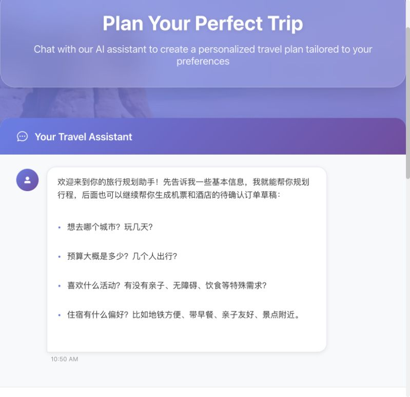
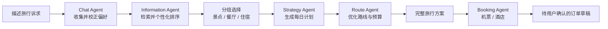
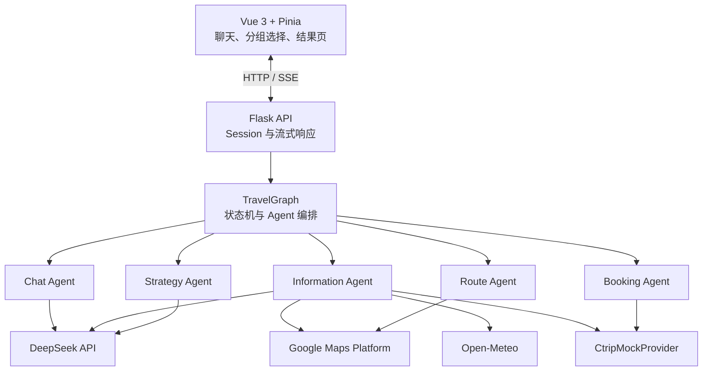

<div align="center">

# Vaiage Trip Agent

**用一句自然语言，完成偏好收集、个性化地点选择、路线规划和预订草稿。**

[](https://vuejs.org/)
[](https://flask.palletsprojects.com/)
[](https://www.deepseek.com/)
[](https://developers.google.com/maps)

</div>

Vaiage 是一个面向国内游和出境游的旅行规划 Multi-Agent 应用。它通过对话理解用户的出发地、目的地、日期、预算、同行人、健康状况、兴趣、餐饮和住宿偏好，再结合 Google Maps 地点数据生成可解释的候选推荐。用户确认景点、餐厅和住宿后，系统会继续生成每日行程、路线与预算，并可通过自然语言创建机票或酒店的待确认预订草稿。

> 当前版本不会创建真实订单，也不会发起支付。酒店房型、机票报价和预订草稿由 `CtripMockProvider` 模拟，用于验证完整产品流程。

## 产品演示



### 完整录屏

[打开在线 HTML 演示页播放完整流程](https://yunjiezou3-tech.github.io/Voyage_TripAgent/recordings/tripagent-demo.html)

> 演示页由 GitHub Pages 托管；如果 Pages 刚开启后暂时无法访问，请稍等 1-2 分钟再刷新。

### 截图演示

| 偏好收集 | 已收集信息 |
| --- | --- |
|  |  |

| 地点候选 | AI 推荐理由 |
| --- | --- |
|  |  |

| 补充推荐 | 结果页 |
| --- | --- |
|  |  |

| 地点选择完成 | 继续聊天预订 |
| --- | --- |
|  |  |

## 可以做什么

| 能力 | 用户体验 |
| --- | --- |
| 对话式偏好收集 | 自动识别必填与可选偏好，并以“一行一项”展示已收集信息，只追问缺失字段 |
| 个性化地点推荐 | 景点、餐厅、住宿分组展示，每张卡片带推荐理由、评分、图片和价格信息 |
| 住宿偏好理解 | 支持区域、预算、评分、早餐、亲子、洗衣房、健身房、吧台、无障碍等条件 |
| 增量推荐 | 在候选页说“再推荐一些便宜餐厅”或“更多亲子酒店”，新增候选会追加且不清除已选项 |
| 行程与路线生成 | 将用户确认的景点、餐厅、酒店作为约束，生成每日安排、路线与预算摘要 |
| 自然语言预订草稿 | 支持酒店、机票或两者，自动继承行程信息并补齐联系人、入住人或乘机人资料 |
| 双草稿并存 | `hotel_draft` 与 `flight_draft` 独立维护，最后一步始终由用户确认，不包含支付 |

## 使用流程



1. 在首页直接描述旅行需求。日期尽量使用具体日期，住宿设施也可以一起说明。
2. 在推荐页分别浏览并选择景点、餐厅和住宿。卡片上的推荐理由来自用户偏好与候选证据。
3. 不满意时继续输入“更多博物馆”“再推荐一些经济型餐厅”或“更多带早餐的亲子酒店”。
4. 点击“确认我的行程地点”，等待系统自动完成策略和路线生成，随后查看结果页。
5. 在同一个聊天助手中说“帮我订酒店”“帮我订往返机票”或“机票酒店都要”，系统会收集最少必要资料并生成待确认草稿。

### 国内游示例

```text
我叫林晨，2026年8月10日从上海出发去北京玩3天，2位成人和1位6岁儿童，
预算12000元，健康状况良好，喜欢历史建筑、博物馆和北京小吃。
住宿希望地铁方便、亲子友好、含早餐，最好有洗衣房和健身房。
```

### 出境游示例

```text
今年10月3日从广州去东京5天，两位成人，预算3万元，喜欢美术馆、街区漫步和日料。
希望住新宿或涩谷地铁站附近的中高档酒店，要早餐和健身房，行程节奏不要太赶。
```

### 候选与预订示例

```text
再推荐一些评分高、适合亲子的酒店
更多人均 150 元以内的本地餐厅
选第二家酒店，帮我生成酒店待确认订单
再帮两位成人生成上海到北京的往返机票草稿
```

## 快速开始

### 1. 环境要求

- Python 3.10 或 3.11
- Node.js 18+
- DeepSeek API Key
- 已启用 Places、Geocoding 和 Directions 能力的 Google Maps API Key

### 2. 安装依赖

```bash
git clone https://github.com/yunjiezou3-tech/nlp_TripAgent.git
cd nlp_TripAgent

python3 -m venv .venv
source .venv/bin/activate
pip install -r Vaiage/requirements.txt

cd nlp_tripagent_frontend
npm install
cd ..
```

### 3. 配置环境变量

```bash
cp Vaiage/.env.development.example Vaiage/.env.development
cp nlp_tripagent_frontend/.env.example nlp_tripagent_frontend/.env.local
```

编辑 `Vaiage/.env.development`，至少填写：

```dotenv
DEEPSEEK_API_KEY=your_deepseek_api_key
MAPS_API_KEY=your_google_maps_api_key
```

所有 `.env` 文件都已被 Git 忽略，请勿把真实 Key 提交到仓库。Google Maps Key 建议同时配置 API 与来源限制。

### 4. 启动项目

```bash
chmod +x start-dev.sh
./start-dev.sh
```

默认地址：

- 前端：<http://localhost:8081>
- 后端：<http://127.0.0.1:8000>

也可以分别启动：

```bash
cd Vaiage
PORT=8000 python3 main.py
```

```bash
cd nlp_tripagent_frontend
VITE_API_BASE_URL=http://127.0.0.1:8000 npm run dev
```

## 系统架构



核心目录：

```text
Vaiage/
  agents/                 # Chat、Information、Strategy、Route、Booking 等 Agent
  services/               # Maps、天气、日期、候选增强、Provider 适配层
  workflows/travel_graph.py
  tests/                  # 后端单元与工作流测试
  main.py                 # Flask API 与 SSE 入口
nlp_tripagent_frontend/
  src/components/         # 聊天与价格组件
  src/views/              # 规划、候选地图、结果页
  src/stores/             # Pinia 会话与行程状态
docs/                     # 设计文档、实施计划与产品图片
```

## 数据来源与边界

| 数据 | 来源 | 当前说明 |
| --- | --- | --- |
| 地点、地址、评分、图片 | Google Maps Places | 真实 API 数据，受调用配额和地区覆盖影响 |
| 餐厅价格 | Google 价格区间或 `price_level` 估算 | 缺少区间时标注为参考人均估算 |
| 酒店基础资料 | Google Maps Places `lodging` | 用于发现和推荐，不代表实时可订库存 |
| 酒店房型与指定日期报价 | `CtripMockProvider` | 模拟价格、早餐、取消政策和库存 |
| 机票候选与订单草稿 | `CtripMockProvider` | 模拟航班、舱位、税费和失效时间 |
| 天气 | Open-Meteo | 外部接口失败时采用可降级处理 |
| 偏好抽取与排序 | DeepSeek | LLM 结果由确定性校验、过滤和状态机约束 |

## 验证

```bash
cd Vaiage
pytest -q
```

```bash
cd nlp_tripagent_frontend
npm run build
```

后端测试覆盖偏好抽取、日期解析、分组推荐、推荐理由、增量候选、价格增强、预订草稿、流式 API 和完整工作流；前端构建会执行 Vue TypeScript 类型检查。

## 当前限制

- 携程能力为 Mock Provider，不能查询真实库存、锁价、下单或支付。
- Google Places 价格档不是指定日期的实时餐厅或酒店价格。
- Flask 文件会话与本地启动脚本面向开发验收，生产部署应替换为持久化会话、反向代理和正式密钥管理。
- 外部 API 的配额、网络与地区覆盖可能影响候选数量，系统会尽量按类别独立降级。

## 更多资料


- [飞书项目完整介绍](https://qcnu7ux7jc90.feishu.cn/wiki/JS3kwRxhEiOLPYkXCUjc1ZMpngb?from=from_copylink)
